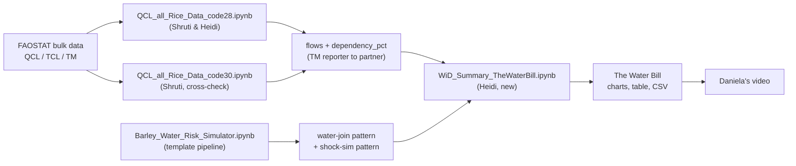

# Project Workflow & Notebook Map: The Water Bill

*Last updated Sept 7, 2026 by Heidi. Read this first if you're opening this repo for the first time or you've lost track of which notebook does what.*

## The short version

We pivoted. The project started as a barley/beer story ("Thirsty Crops"), but barley's top producer (Russia) isn't water-stressed, which broke the narrative. As of Sept 7, the project is **rice-focused**, built around a deliverable Daniela named **"The Water Bill"**: a water-exposure score for a country's rice imports, with a shock-simulation feature (what happens if a stressed supplier's crop drops 10/20/30%) and an alternative-supplier recommendation.

The barley work isn't wasted. `Barley_Water_Risk_Simulator.ipynb` already built the exact pipeline shape we need (production, water-stress join, trade dependency, shock simulation, AI brief), just pointed at the wrong crop. Most of today's work is **porting that pipeline onto the rice data**, not building from zero.

## Notebook & document inventory

| File | Author(s) | What it covers | Status | Role now |
|---|---|---|---|---|
| `Barley_Water_Risk_Simulator.ipynb` | original team build | Full barley pipeline: production ranking, SDG 6.4.2 water-stress join, Trade Matrix supplier dependency, `simulate_shock()` function, AI-written resilience brief | Complete, for barley | **Template.** We're porting Sections 3-4 (water join) and Section 7 (shock sim) onto rice. Not part of the final deliverable itself. |
| `Reverse_Water_Stress_Crop_Driver.ipynb` | Kaveesha | Early water-first crop screening (this is where we learned "top crops" finds water-*abundant* places, not stressed ones) | Historical | Background/methodology reference only |
| `Water_Burden_Explorer.ipynb` | Heidi | ET/FBS/PP data loaders, water-burden-per-crop scaffold | Historical, not rice-specific | Background only |
| `wid_foastat_thirsty_crops_eda_20260819.ipynb` | Shruti | First FAOSTAT exploration | Historical starting point | Background only |
| `QCL_all_Rice_Data_code28.ipynb` | Shruti & Heidi | Rice production (QCL code 27) + exports (TCL codes 28÷0.77 + 31÷0.67, paddy-equivalent) + production-vs-export scatter + TM reporter/partner flows with `dependency_pct` | In progress, stops at the water-join TODO | **Primary rice trade source** |
| `QCL_all_Rice_Data_code30.ipynb` | Shruti | Same shape as above, but export side uses FAO's own code-30 milled-equivalent accumulator as a validation path | In progress, same TODO | **Cross-check / validation source** |
| `QCL_TCL_Cotton_Data.ipynb` | Shruti | Cotton production/trade, parallel structure to rice | Out of scope for now | Deprioritized (not part of the rice story) |
| `WiD_CodesForRiceAndConfusion.docx` | Heidi | Reference: which rice item codes to use for production/export and which to avoid (29, 32, 30 as a direct substitute) and why | Complete | Documentation, cite this if anyone asks "why code 28+31?" |
| `datathon_initial_ideas_09072026.docx` | Daniela + team | Problem statement, "Water Bill" deliverable spec, meeting notes, RACI history | Living document | Source of truth for scope and the exact numbers the video needs to hit |
| `WiD_Summary_TheWaterBill.ipynb` (new) | Heidi, built today | Ports the barley water-join and shock-sim logic onto the rice data; produces the final charts, table, and CSV | **To build this session** | **Final summary notebook** |

## To-do tracker (ties to the Water Bill's 4 components)

| # | What | Pulls from | Owner | Water Bill component |
|---|---|---|---|---|
| TODO-1 | Join rice reporters/partners to Aquastat/SDG 6.4.2 water stress | Barley §3-4 pattern -> rice lists in code28/30 | Heidi | Component 1: Water exposure |
| TODO-2 | Verify Daniela's headline stats (Pakistan 107% withdrawal, 53% export share; Afghanistan 98%, Kazakhstan 86%, Kenya 67% dependency; Egypt 113%/83%) against real computed output | TODO-1's join + existing `dependency_pct` | Heidi | Credibility check, not a component itself, but blocks the video |
| TODO-3 | Formalize supplier concentration index per importer | Existing `dependency_pct` in code28/30's `flows` df | Heidi | Component 2: Supplier concentration |
| TODO-4 | Port `simulate_shock()` to model a Pakistan supply cut | Barley §7 | Heidi | Component 3: Shock result |
| TODO-5 | Rank alternative suppliers by spare capacity + water headroom | Barley §7's `diversify=True` path | Heidi | Component 4: Alternative suppliers |
| TODO-6 | Country selector + CSV export | Packaging on top of TODO-1 through 5 | Heidi/Kaveesha | Deliverable packaging (stretch goal, after the 11th check-in if not done today) |
| TODO-7 | Video script and recording | The finished summary notebook's charts | Daniela | Presentation |

## How the pieces connect



## Section-labeling convention (use this going forward, in every notebook)

So nobody has to guess where a number came from or where it's going, every markdown header that does real analytical work should follow this pattern:

```
## [TODO-<n> | <Water Bill component>] <plain description> (adapted from <source notebook/section>, credit: <author>)
```

Example, from the new summary notebook:

```
## [TODO-1 | Water Exposure] Join rice reporter/partner countries to SDG 6.4.2 water stress
(adapted from Barley_Water_Risk_Simulator.ipynb Section 3-4; rice flows from QCL_all_Rice_Data_code28.ipynb Section 3, Shruti & Heidi)
```

This gives three things at a glance: which to-do it resolves, which Water Bill component it feeds, and which earlier notebook and person's work it's built on. That last part matters as much as the first two, this is Shruti's and Kaveesha's work as much as anyone's, and the label should say so.

## Planned structure of `WiD_Summary_TheWaterBill.ipynb`

Using the convention above, this is the section plan for today's build:

1. **Overview cell** (markdown only): links back to this workflow doc, states the deliverable in one paragraph, lists data sources and their vintage (2000-2024, FAOSTAT).
2. **[TODO-1 | Water Exposure]** Water-stress join, adapted from Barley §3-4, applied to the rice reporter/partner lists from code28/30.
3. **[TODO-2 | Credibility check]** Side-by-side table: Daniela's claimed stats vs. what this notebook computes. Flag matches and mismatches explicitly, don't silently overwrite her numbers.
4. **[TODO-3 | Supplier Concentration]** Concentration index per importer, built on the existing `dependency_pct`.
5. **[TODO-4 | Shock Result]** Pakistan shock scenario via the ported `simulate_shock()`.
6. **[TODO-5 | Alternative Suppliers]** Diversification ranking, `simulate_shock(..., diversify=True)`.
7. **Video-ready exports**: the 3-4 charts (global concentration, production-vs-export scatter reused from code28/30, the Pakistan case study, the rice x water table) saved as image files, plus the underlying table as CSV.
8. **Limitations & next steps** (mirrors Barley §9's pattern): what's verified vs. estimated, what's still TODO-6/7.

Anyone opening this notebook cold should be able to read the section headers alone and know exactly what question is being answered, whose earlier work it's standing on, and which piece of the final deliverable it produces.
