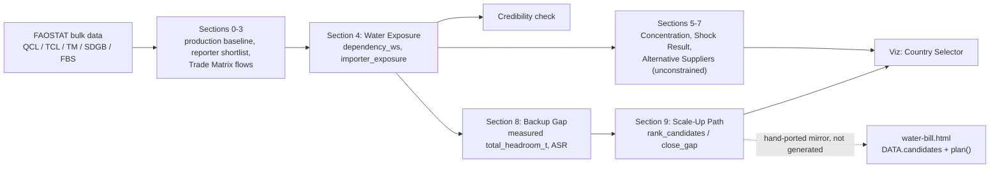
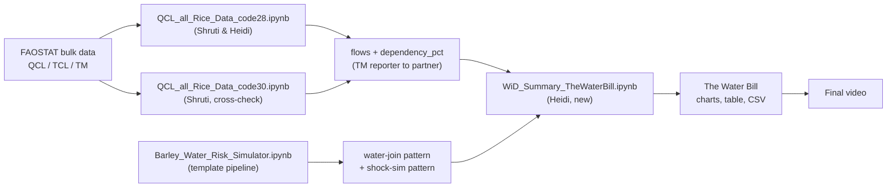

# Project Workflow & Notebook Map: The Water Bill

*Last updated Sept 14, 2026 by Kaveesha. Read this first if you're opening this repo for the first time or you've lost track of which notebook does what.*

## Start here if you're new to this repo (or anyone who isn't living in the code)

You only need to know five things:

1. Everything that actually made it into the video comes from one folder: **`summary/`**. If you open nothing else, open `summary/WiD_Summary_TheWaterBill_Combined.ipynb` - it merges the original Water Bill notebook and the later Backup Gap notebook into one, written top to bottom as a story, not as scratch code. (`summary/components/` holds the earlier, separate pieces it was assembled from - not needed unless you're comparing history.)
2. **[Interactive dashboard](https://dmatinho.github.io/seed-and-scale/summary/water-bill.html)**: pick an importer, see its supplier mix, run the shock scenario, and see the ranked backup-supplier plan, live in a browser, no Colab needed. See "How the notebook flows" below for how its data relates to the notebook.
3. **`summary/water-bill.html`** is the dashboard's source code, in this repo - not auto-generated from the notebook, see "How the notebook flows" below for how the two are kept in sync.
4. **`discovery/`** is our scratch work and dead ends, kept for the record and for judges who ask "how did you get there." You don't need to open it unless you're curious.
5. **`docs/`** has the two Word docs: the rice-code reference sheet, and the problem statement with the exact numbers we're claiming in the video.

Everything below this point is for whoever's writing code.

## How the notebook flows

`summary/WiD_Summary_TheWaterBill_Combined.ipynb`, top to bottom:

**Setup & data pull (Sections 0-3)**
- Section 0: imports, config, output folder.
- Section 1: rice production baseline (FAOSTAT QCL).
- Section 2: which exporters are big/consistent enough to shortlist for the Trade Matrix pull.
- Section 3: Trade Matrix reporter-to-partner rice flows (`dependency_pct` per importer/exporter
  pair) - everything downstream builds on this.

**Water exposure (Section 4)**
- Section 4 `[Water Exposure]`: joins the Section 3 trade flows to SDG 6.4.2 water-stress data,
  producing `dependency_ws`, `importer_exposure`, `NAME_ALIASES` - the core dataframes nearly
  everything else reuses.
- Sub-sections: the water-volume figure (Mekonnen & Hoekstra footprint x tonnage) and the food
  self-sufficiency figure (a separate FAOSTAT FBS pull, feeding the Egypt row in the Credibility
  check below).
- `[Viz][Country Trend View]`: four static per-country production/export/water-stress time
  series. Depends only on Section 4's join, not on anything after it - that's why it sits here
  rather than at the end.

**Credibility check**
- Compares the project's claimed headline numbers against what the notebook actually computes,
  flagging matches and mismatches explicitly rather than silently trusting either one. Also
  defines `computed_water_stress()` and `computed_dependency_on_pakistan()`, which the Overlap
  check (inside Section 6) reuses.

**Concentration & shock (Sections 5-7)**
- Section 5 `[Supplier Concentration]`: HHI concentration index per importer.
- Section 6 `[Shock Result]`: Pakistan-specific shock scenario via `simulate_shock()`; its Overlap
  check sub-section verifies the named importers actually appear as Pakistan's buyers in this data.
- Section 7 `[Alternative Suppliers]`: diversification ranking, assuming *unconstrained* headroom
  at alternative suppliers.
- `[Shock Result -- breadth]`: generalizes the Pakistan case study to the top-15 most exposed
  importers.

**Backup Gap - the capacity-constrained version (Section 8)**
- Section 8.1: intro - replaces Section 7's unconstrained-headroom assumption with a measured one.
- Section 8.2: `total_headroom_t` per supplier (measured spare export capacity, not assumed).
- Section 8.3: Afghanistan worked example.
- Section 8.4: Alternative Supply Ratio (ASR) - which importers have zero real alternative supply,
  scored the same way across the whole dataset.

**Scale-up planning (Section 9)**
- Section 9 `[Scale-Up Path]`: `rank_candidates`/`close_gap` waterfall - who'd have to scale up,
  and by how much, per importer.
- Section 9.2 `[Scale-Up Path]`: the same question, but with every importer drawing on one shared
  capacity pool at once instead of each getting the whole pool to itself.

**Interactive exploration**
- `[Viz][Country Selector]`: a live dropdown (Colab-only) reusing `build_shock_profile()` to show
  any importer's full profile - the one piece of the notebook that needs a running kernel, not
  just GitHub's static view.

**Wrap-up**
- Limitations & next steps: what's verified vs. estimated/simplified, across both the Water Bill
  and Backup Gap halves.

**`summary/water-bill.html`**: not generated from the notebook - a hand-built, standalone page
whose `DATA.candidates` ranking and `plan()` allocation logic mirror Section 8/9's
`scale_up_plan`/`close_gap` machinery. If that logic changes in the notebook, the HTML page's data
needs a matching manual update. Live at
[dmatinho.github.io/seed-and-scale/summary/water-bill.html](https://dmatinho.github.io/seed-and-scale/summary/water-bill.html)
via GitHub Pages on dmatinho's fork.

## Recent changes (Sept 14, 2026)

`summary/WiD_Summary_TheWaterBill_Combined.ipynb` merges the original Water Bill notebook and the
later Backup Gap notebook (`summary/components/WiD_Summary_TheBackupGap.ipynb`) into one notebook.
Since the merge, it's been through a cleanup pass to get it ready to share outside the team:

- **Section headers de-numbered, then renumbered.** The old `[TODO-<n> | Component]` labels were
  dropped down to just `[Component]` (the TODO tracking was internal bookkeeping, not needed once
  the sections were built), then reworked into the `Section N:` outline described above.
- **Scrubbed for an external audience.** Individual names, internal file citations (this doc,
  `GIT_RUNBOOK.md`, the `docs/*.docx` files, the `discovery/` notebooks), and internal production
  language ("the video," "the deck," "bring this to the team") were removed or reworded so the
  notebook reads as a standalone analysis. References to content that used to live in the separate
  Water Bill and Backup Gap notebooks were repointed to the in-notebook section instead, now that
  both are merged into one file.
- **Dead sections removed:** the old "exports for the deck" CSV cell, the "Process to save directly
  to GitHub" cell (duplicated `GIT_RUNBOOK.md`), and the "Video-ready exports" Colab/GitHub
  save-workflow cell.
- **`[Viz][Country Trend View]` reworked and moved.** Its interactive picker was removed (wasn't
  returning results), so it now only describes its four static charts; moved to sit right after
  Section 4, the only place its data actually comes from.
- **The two "Limitations & next steps" cells were merged into one**, at the end of the notebook;
  the resulting "Next steps" list was then dropped, since this is a final submission rather than a
  living document.
- **`[Credibility check]` kept, deliberately** - it demonstrates the notebook checking its own
  claimed numbers against computed FAOSTAT data, rather than removing that step once the check
  had been run.
- **Bug fix:** `import re` was missing (needed by `_slugify()` for the trend-chart filenames);
  added to the Section 0 setup cell.

## History

Kept for context on how the project got here - none of this is current instruction, see "How the
notebook flows" above for that.

### The pivot: barley to rice

We pivoted. The project started as a barley/beer story ("Thirsty Crops"), but barley's top
producer (Russia) isn't water-stressed, which broke the narrative. As of Sept 7, the project
became **rice-focused**, built around a deliverable named **"The Water Bill"**: a
water-exposure score for a country's rice imports, with a shock-simulation feature (what happens
if a stressed supplier's crop drops 10/20/30%) and an alternative-supplier recommendation.

The barley work wasn't wasted. `Barley_Water_Risk_Simulator.ipynb` already built the pipeline
shape needed (production, water-stress join, trade dependency, shock simulation, AI brief), just
pointed at the wrong crop - most of the early work was porting that pipeline onto rice data, not
building from zero.

### Original file reorg (completed)

The repo started as everything loose at the top level. It was reorganized by purpose into
`discovery/` (scratch work and dead ends), `summary/` (the deliverable), `docs/` (reference docs),
and `scripts/` - the layout the repo still uses today. `summary/components/` was added later to
hold the separate Water Bill and Backup Gap notebooks before they were merged into
`WiD_Summary_TheWaterBill_Combined.ipynb`.

### Original notebook & document inventory

*(Filenames below are pre-reorg, root-level names as they existed on Sept 7.)*

| File | Author(s) | What it covers | Status | Role at the time |
|---|---|---|---|---|
| `Barley_Water_Risk_Simulator.ipynb` | original team build | Full barley pipeline: production ranking, SDG 6.4.2 water-stress join, Trade Matrix supplier dependency, `simulate_shock()` function, AI-written resilience brief | Complete, for barley | Template - Sections 3-4 (water join) and Section 7 (shock sim) were ported onto rice |
| `Reverse_Water_Stress_Crop_Driver.ipynb` | Kaveesha | Early water-first crop screening (this is where the team learned "top crops" finds water-*abundant* places, not stressed ones) | Historical | Background/methodology reference only |
| `Water_Burden_Explorer.ipynb` | Heidi | ET/FBS/PP data loaders, water-burden-per-crop scaffold | Historical, not rice-specific | Background only |
| `wid_foastat_thirsty_crops_eda_20260819.ipynb` | Shruti | First FAOSTAT exploration | Historical starting point | Background only |
| `QCL_all_Rice_Data_code28.ipynb` | Shruti & Heidi | Rice production (QCL code 27) + exports (TCL codes 28÷0.77 + 31÷0.67, paddy-equivalent) + production-vs-export scatter + TM reporter/partner flows with `dependency_pct` | Primary rice trade source | Fed the water join in the summary notebook |
| `QCL_all_Rice_Data_code30.ipynb` | Shruti | Same shape as above, but export side uses FAO's own code-30 milled-equivalent accumulator as a validation path | Cross-check / validation source | Used to sanity-check code28's numbers |
| `QCL_TCL_Cotton_Data.ipynb` | Shruti | Cotton production/trade, parallel structure to rice | Out of scope | Deprioritized (not part of the rice story) |
| `WiD_CodesForRiceAndConfusion.docx` | Heidi | Reference: which rice item codes to use for production/export and which to avoid (29, 32, 30 as a direct substitute) and why | Complete | Cited whenever a "why code 28+31?" question comes up |
| `datathon_initial_ideas_09072026.docx` | team | Problem statement, "Water Bill" deliverable spec, meeting notes, RACI history | Living document | Source of truth for scope and the exact numbers the video needs to hit |

### Original to-do tracker

| # | What | Pulls from | Owner | Water Bill component |
|---|---|---|---|---|
| TODO-1 | Join rice reporters/partners to Aquastat/SDG 6.4.2 water stress | Barley §3-4 pattern -> rice lists in code28/30 | Heidi | Component 1: Water exposure |
| TODO-2 | Verify the claimed headline stats (Pakistan 107% withdrawal, 53% export share; Afghanistan 98%, Kazakhstan 86%, Kenya 67% dependency; Egypt 113%/83%) against real computed output | TODO-1's join + existing `dependency_pct` | Heidi | Credibility check, not a component itself, but blocks the video |
| TODO-3 | Formalize supplier concentration index per importer | Existing `dependency_pct` in code28/30's `flows` df | Heidi | Component 2: Supplier concentration |
| TODO-4 | Port `simulate_shock()` to model a Pakistan supply cut | Barley §7 | Heidi | Component 3: Shock result |
| TODO-5 | Rank alternative suppliers by spare capacity + water headroom | Barley §7's `diversify=True` path | Heidi | Component 4: Alternative suppliers |
| TODO-6 | Country selector + CSV export | Packaging on top of TODO-1 through 5 | Heidi/Kaveesha | Deliverable packaging |
| TODO-7 | Video script and recording | The finished summary notebook's charts | team | Presentation |

All seven are done; the Backup Gap and Scale-Up Path work (Sections 8-9.2) came later and was
never tracked in this table.

### Original notebook-to-notebook flow diagram (pre-merge)

This predates the Backup Gap merge and the `Combined` notebook - see "How the notebook flows"
above for the current pipeline.
